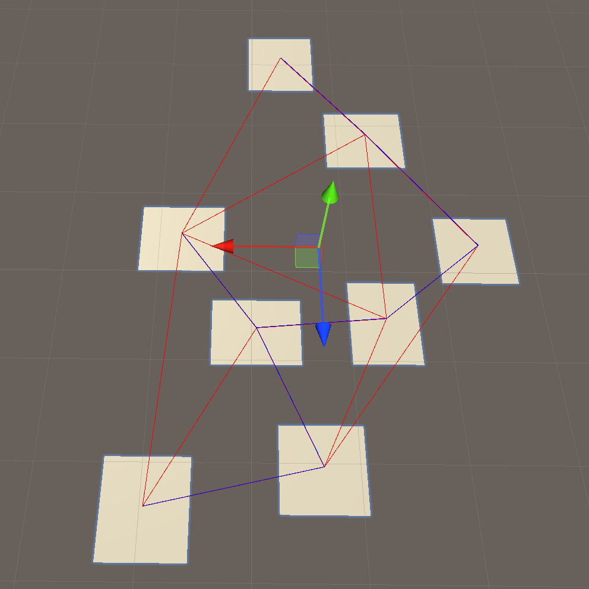
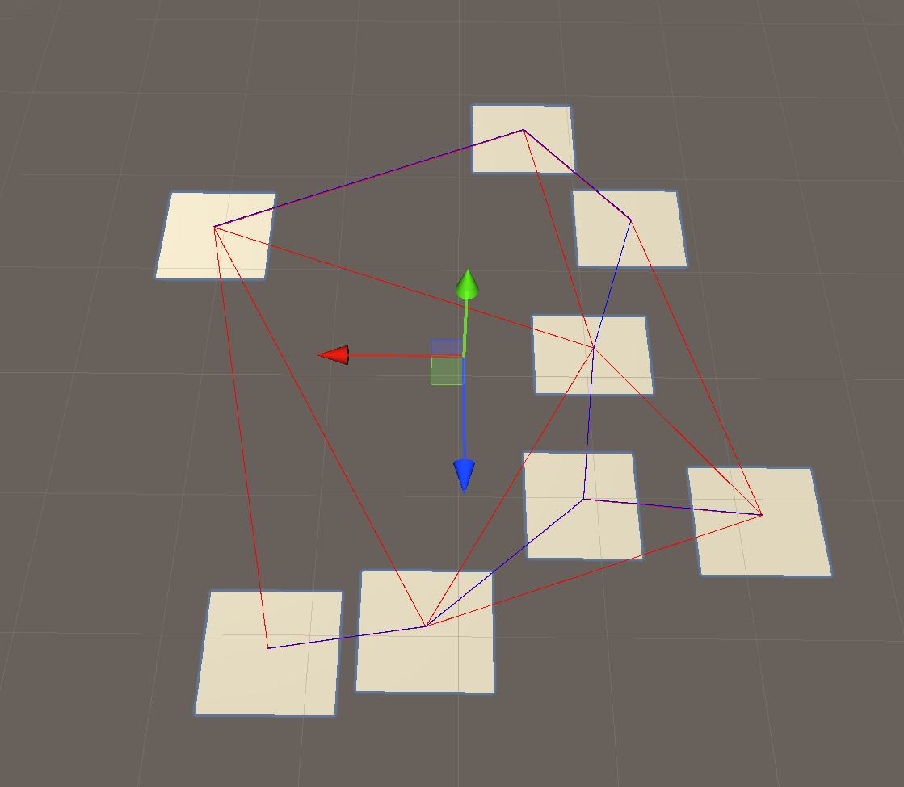

# ProceduralDungeonGeneration

Unity implementation of the dungeon generation algorithm described here: https://www.gamasutra.com/blogs/AAdonaac/20150903/252889/Procedural_Dungeon_Generation_Algorithm.php 

No additional libraries were used for triangulation (red lines) and minimum spanning tree (blue lines).

 

The last step (drawing hallways) is missing.

Demonstration: https://www.youtube.com/watch?v=PPtRLh4L_fA 
